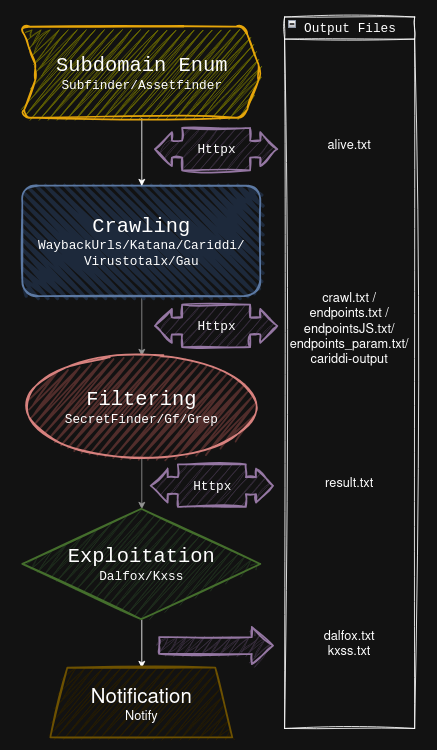

# Choom - A Web Crawling & Vulnerability Workflow

Choom is a workflow manager for web application reconnaissance. It supports several well-known tools and is designed to chain tasks from a single command, automatically adapting the appropriate syntax for each tool.

"Choom is the result of a personal need. The need to automate the reconnaissance phase of Bug-Bounty programs by automatically managing the chaining of tasks to be performed from a single command."

## Table of Contents

-   [Installation](#installation)
-   [Workflow](#workflow)
-   [Usage](#usage)
-   [Options](#options)
-   [Output](#output)
-   [Configuration](#configuration)
-   [Notification](#notification)
-   [Contributions](#contributions)

## Installation

1. **Requirements**: Install the latest version of Go

    ```bash
    sudo apt-get update && sudo apt-get -y install golang-go
    ```

2. **Clone the GitHub repository**: Install dependencies and tools on your system using the installation files.
    ```bash
    git clone https://github.com/maxmnml/choom.git
    cd choom
    pip3 install -r requirements.txt
    /bin/bash install.sh
    ```
3. **(Optional)**: To use choom from anywhere, you can create a symbolic link in a directory that's in your PATH. For example:
    ```bash
    sudo ln -s /full/path/to/choom.py /usr/local/bin/choom
    ```

## Supported Tools

| Tool                                                        | Description                                                    |
| ----------------------------------------------------------- | -------------------------------------------------------------- |
| [cariddi](https://github.com/edoardottt/cariddi)            | Fast crawler and endpoint secrets / api keys / tokens matcher. |
| [dalfox](https://github.com/hahwul/dalfox)                  | Powerful scanner for XSS flaws.                                |
| [gf](https://github.com/tomnomnom/gf)                       | A wrapper around grep to avoid typing common patterns.         |
| [httpx](https://github.com/projectdiscovery/httpx)          | Fast and multi-purpose HTTP toolkit.                           |
| [katana](https://github.com/projectdiscovery/katana)        | Fast and fully configurable web crawler.                       |
| [notify](https://github.com/projectdiscovery/notify)        | Send notifications to a variety of supported platforms.        |
| [secretFinder](https://github.com/m4ll0k/SecretFinder)      | Discover sensitive data in JavaScript files.                   |
| [virustotalx](https://github.com/orwagodfather/virustotalx) | Offline crawler using Virustotal API.                          |
| [waybackurls](https://github.com/tomnomnom/waybackurls)     | Offline crawler using Web Archive.                             |

## Workflow



At each step and sub-step of the workflow, the target URL and the command executed by the task manager are displayed.


During the execution of the workflow, using the `Ctrl-C` command allows you to stop the current task and move on to the next one without stopping the workflow.


## Usage

```bash
# Display help
python3 choom.py -h

# Run a single URL workflow
python3 choom.py -u https://example.com

# Run workflow with a list input
python3 choom.py -f urls.txt

# If you want to use your own list of endpoints, you can bypass the crawling process by indicating the directory where your files are located. (Files must be renamed "endpoint.txt" and "endpointJs.txt")
python3 choom.py --no-crawl --path /path/to/directory
```

## Options


#### Crawler Configuration

`-rl` Controls the number of requests sent per second to avoid overloading the target server. (default=150)

`-cr` Specifies how many requests can be sent simultaneously. (default=10)

`-d` Defines the depth to follow URLs during crawling. The greater the depth, the more endpoints are crawled, but it also increases the crawling time. (default=3)

`-sd` This option allows Waybackurls to include subdomains of the target domain.

```bash
python3 choom.py -u https://example.com -d 10 -cr 5 -d 2
```

#### Headers

`-ua` Option to specify a custom User-Agent. This can be useful for certain Bug Bounty programs that require a specific User-Agent.

`-c` Option to provide cookies for authenticated crawling.

```bash
python3 choom.py -u https://example.com -ua "MyUserAgent" -c "session=123abc"
```

#### Headless

`-hl`: Katana's headless mode uses internal headless calls to process HTTP requests/responses directly in the browser context without incognito mode. This allows the client to be fully identified as a legitimate browser and bypass aggressive WAFs.

```bash
python3 choom.py -u https://example.com -hl
```

#### Proxy

`-p` : Proxy option defines the proxy server to be used for analysis. This allows you to route endpoints to your preferred proxy (Burpsuite, Caido, Zap, ...) for manual analysis later on. Endpoints transmitted are the same as "endpoints.txt" file.

```bash
python3 choom.py -u https://example.com -p "http://127.0.0.1:8080"
```

#### Filtering

`-dd`: By default, JPG, PNG, and PDF extensions are not included in the endpoints displayed in the results. This option enables filtering of these results, which can be useful for financial targets.

#### Skip Crawling

If you use different or complementary tools for the crawling step, or if you want to resume the workflow directly from the result filtering step, the following options allow this:

`--no-crawl`: This option allows you to skip the crawling step and go directly to the result filtering step.

`--path`: If the `--no-crawl` option is enabled, this allows you to specify the path to the directory containing the `endpoints.txt` and `endpointJS.txt` files (the files must be renamed accordingly).

```bash
python3 choom.py --no-crawl --path /path/to/directory
```

## Output

To keep track and organize all the results obtained during the execution of workflows, the output file structure is as follows:

-   In the current directory, a folder named `/content` is created.
-   For each new workflow, an incremented subfolder `/content/xx` is created.
-   All output files are saved in this subfolder throughout the execution of the workflow.


## Configuration

### Virustotalx

-   The Virustotalx crawler script is available directly in this repository: `choom/src/script/virustotalx.sh`.
-   The script uses the Virustotal API. It is therefore necessary to create 1 to 3 free (Public) accounts on https://www.virustotal.com/gui/join-us and copy the 1 to 3 API keys at the beginning of the code (API-KEY01, API-KEY02, API-KEY03):

```bash
  if [ $api_key_index -eq 1 ]; then
    api_key="API-KEY01"
  elif [ $api_key_index -eq 2 ]; then
    api_key="API-KEY02"
  else
    api_key="API-KEY03"
  fi
```

In the free (Public) version, a Virustotal account has certain limitations, requiring the creation of multiple accounts if you need to run a workflow on a list of targets.

"The Public API is limited to 500 requests per day and a rate of 4 requests per minute".

### SecretFinder

-   The SecretFinder filter script is available directly in this repository: `choom/src/script/SecretFinder.py`.

-   SecretFinder is a Python script written to discover sensitive data like API keys, access tokens, authorizations, JWTs, and more in JavaScript files.

-   You can add your own regex patterns in the code to filter anything you want, such as words, characters, patterns, and more. (Additional regex patterns have been added to the original script).

```bash
# regex
_regex = {
    'google_api'     : r'AIza[0-9A-Za-z-_]{35}',
    'firebase'  : r'AAAA[A-Za-z0-9_-]{7}:[A-Za-z0-9_-]{140}',
    'google_captcha' : r'6L[0-9A-Za-z-_]{38}|^6[0-9a-zA-Z_-]{39}$',
    'google_oauth'   : r'ya29\.[0-9A-Za-z\-_]+',
    'amazon_aws_access_key_id' : r'A[SK]IA[0-9A-Z]{16}',
    'amazon_mws_auth_toke' : r'amzn\\.mws\\.[0-9a-f]{8}-[0-9a-f]{4}-[0-9a-f]{4}-[0-9a-f]{4}-[0-9a-f]{12}',
    'amazon_aws_url' : r's3\.amazonaws.com[/]+|[a-zA-Z0-9_-]*\.s3\.amazonaws.com',
    ...}
```

### Gf

-   Gf is a wrapper around grep to avoid typing common patterns.
-   Choom uses the following Gf pattern files: 'lfi', 'ssrf', 'rce', 'interestingparams', 'idor', 'xss'.
-   It is possible to add your own pattern files or add your own entries to existing files to customize the result filtering.
-   The pattern definitions are stored in `~/.gf` as little JSON files.

## Notification

`-n` Enables "Notify" to alert you when the workflow finished.

The default provider config file can be created at `$HOME/.config/notify/provider-config.yaml` and can have the following contents (Discord exemple):

```bash
discord:
  - id: "crawl"
    discord_channel: "crawl"
    discord_username: "test"
    discord_format: "{{data}}"
    discord_webhook_url: "https://discord.com/api/webhooks/XXXXXXXX"
```

**How to create a discord webhook** -> [Create webhook discord](https://support.discord.com/hc/en-us/articles/228383668-Intro-to-Webhooks)

For more features and support -> [Notify github page](https://github.com/projectdiscovery/notify)

## Contributions

This project is a first attempt at programming, so the code is likely to be bad and poorly optimized. Mea culpa!!!

If you are interested in this project, like the tool, or simply pity my programming skills, contributions are welcome!

Please submit a pull request or open an issue to discuss the changes you would like to make.

## Acknowledgements

Thanks in advance to all the contributors who will take some of their time to help develop this project. Thanks to the authors of the tools used in this project for sharing their work with the community. Thanks also to ... for the inspiration they gave me in creating this tool. [projectdiscovery](https://github.com/projectdiscovery), [tomnomnom](https://github.com/tomnomnom), [edoardottt](https://github.com/edoardottt), [hahwul](https://github.com/hahwul), [orwagodfather](https://github.com/orwagodfather), [m4ll0k](https://github.com/m4ll0k), [freelabz](https://github.com/freelabz) & more ...
